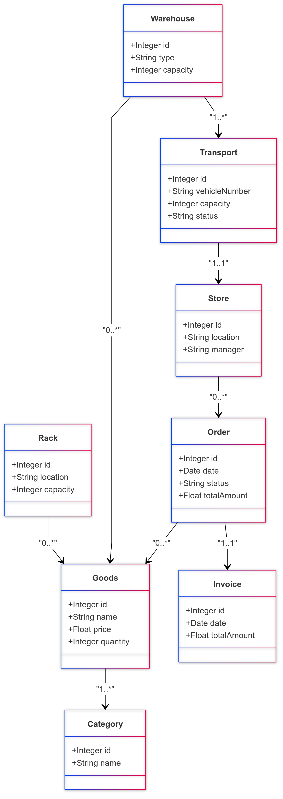
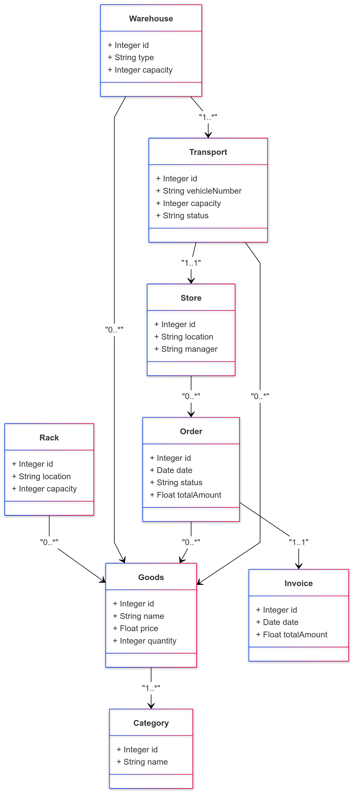
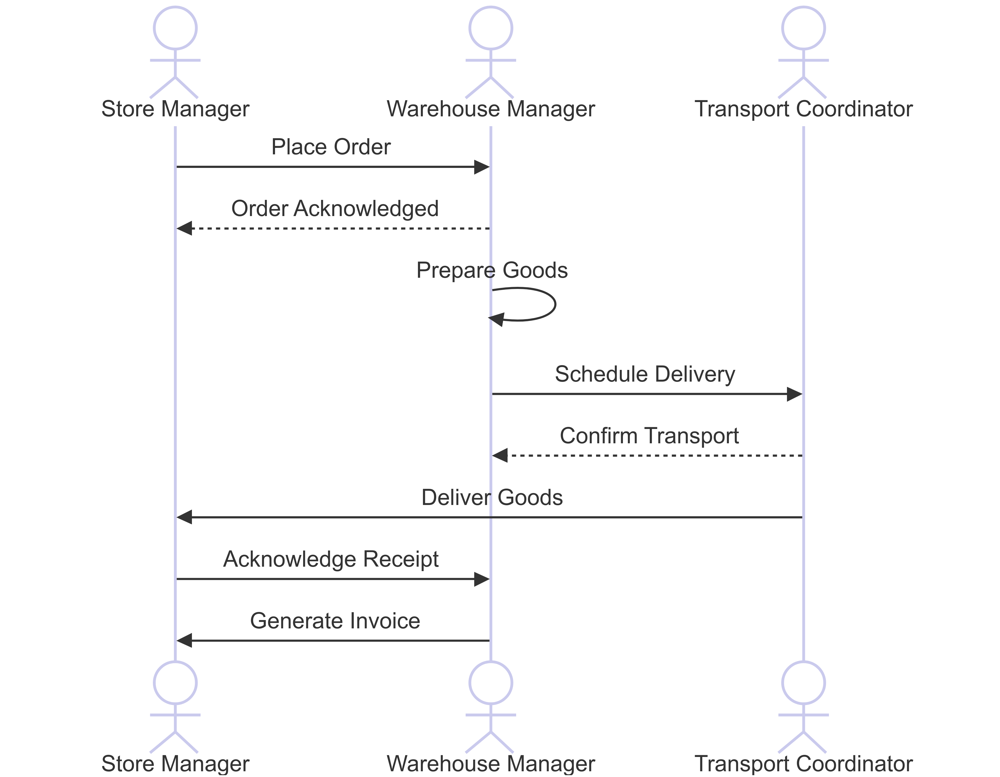
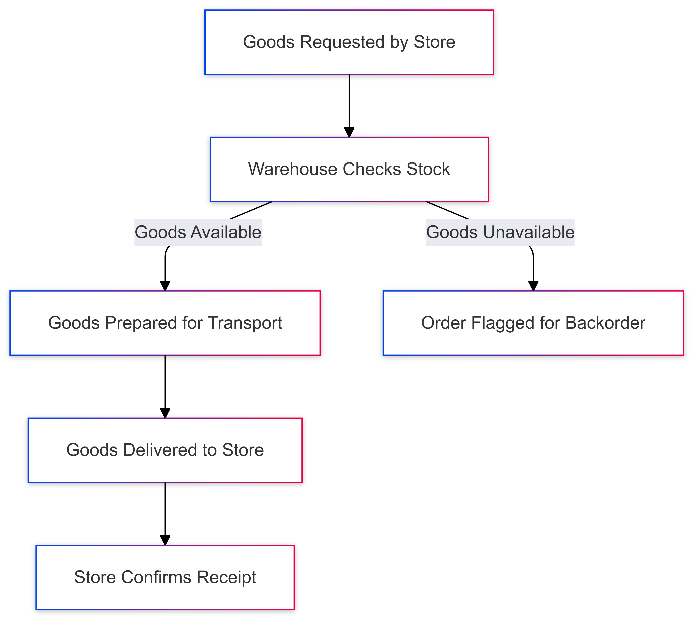

#### Task 1: Create Model for "Grocery Store"

##### UML Class Diagram:

<!--  -->


**Key Entities:**
1. **Goods**
   - Attributes: id, name, price, quantity
   - Relationships: Linked to Category, located on Racks, stored in Warehouses

2. **Category**
   - Attributes: id, name
   - Relationships: Contains multiple Goods

3. **Rack**
   - Attributes: id, location, capacity
   - Relationships: Holds multiple Goods

4. **Warehouse**
   - Attributes: id, type (central/local), capacity
   - Relationships: Stores multiple Goods, Supplies Goods to Stores

5. **Store**
   - Attributes: id, location, manager
   - Relationships: Places Orders, Receives Goods from Warehouse, Issues Invoices

6. **Order**
   - Attributes: id, date, status, totalAmount
   - Relationships: Links Store and Goods

7. **Invoice**
   - Attributes: id, date, totalAmount
   - Relationships: Generated for an Order

8. **Transport**
   - Attributes: id, vehicleNumber, capacity, status
   - Relationships: Connects Warehouse, Store, and Goods

**Relationships:**
- Binary:
  - Goods belong to a Category (1..*).
  - Racks hold Goods (0..*).
  - Warehouses store Goods (0..*).
- Ternary:
  - Transport links Warehouse, Store, and Goods.

---

##### Sequence Diagram

The sequence diagram describes the process of a store placing an order and receiving goods:



**Actors:** Store Manager, Warehouse Manager, Transport Coordinator

**Steps:**
1. Store Manager places an order.
2. The order is sent to the Warehouse.
3. Warehouse Manager prepares the Goods.
4. Transport Coordinator schedules the delivery.
5. Goods are delivered to the Store.
6. Store Manager acknowledges receipt.
7. Invoice is generated for the order.

---

##### Activity Diagram

The activity diagram describes the flow of goods from the central warehouse to a local store:

<!--  -->


**Steps:**
1. Goods are requested by the store.
2. The warehouse checks stock availability.
3. If goods are available:
   - Goods are prepared for transport.
   - Transport is assigned to deliver goods.
4. If goods are unavailable:
   - The order is flagged for backorder.
5. Goods are delivered to the store.
6. Store confirms receipt of goods.

---

##### OCL Constraints

1. **Invariant: Rack Capacity**
   ```
   context Rack
   inv: self.goods->size() <= self.capacity
   ```
   - Ensures that the number of goods on a rack does not exceed its defined capacity.
2. **Invariant: Warehouse Stock**
   ```
   context Warehouse
   inv: self.goods->forAll(g | g.quantity >= 0)
   ```
   - Ensures all goods stored in the warehouse have non-negative quantities.
3. **Pre-condition and Post-condition: Order Creation**
   ```
   context Order::createOrder()
   pre: self.goods->notEmpty() and self.totalAmount > 0
   post: self.status = 'Created'
   ```
   - Pre-condition: Checks that an order is meaningful (contains goods and has a positive total amount).
   - Post-condition: Sets the order status to 'Created' after successful creation.
4. **Pre-condition and Post-condition: Transport Assignment**
   ```
   context Transport::assign()
   pre: self.status = 'Available'
   post: self.status = 'Assigned'
   ```
   - Pre-condition: Ensures transport is available before assignment.
   - Post-condition: Updates the status to 'Assigned' after the transport is allocated.
---

#### Task 2: Document Your Solution

##### Key Design Decisions
1. **Entity Selection:** Focused on core components like goods, racks, warehouses, and transport to maintain clarity and relevance.
2. **Relationships:** Used binary and ternary relationships to effectively represent real-world interactions.
3. **Abstraction Level:** Avoided excessive detail (e.g., specific vehicle routing or employee shifts).
4. **OCL Constraints:** Added constraints to ensure data integrity and logical consistency.

---

#### Task 3: Evaluation of the Solution

##### 1. Level of Abstraction
   - **Ignored Details:** Customer interaction, product returns, shelf arrangements.
   - **Appropriate Abstraction:** Focused on the supply chain and inventory processes.

##### **2. Level of Approximation**
   - **Under-specification:** Some operational details, like scheduling, are not modeled.
   - **Over-specification:** Relationships and constraints are adequately defined without being overly restrictive.

##### **3. Ambiguity vs. Precision**
   - **Strengths:** Clear multiplicities and constraints reduce ambiguity.
   - **Weaknesses:** Certain real-world exceptions (e.g., delayed transport) are not captured.

##### **4. Completeness**
   - The model adequately covers ordering, storage, and delivery processes but does not include rare scenarios like damaged goods or emergency orders.

---

#### **Task 4: Opinion on Modeling Language, Tools, and Methodology**

##### **Effectiveness of UML and OCL**
- **Strengths:**
  - Provides a structured, visual representation of complex systems.
  - Facilitates alignment among stakeholders during design.
  - OCL ensures logical correctness and data integrity.

- **Weaknesses:**
  - High learning curve for OCL.
  - Maintaining detailed diagrams for large systems can be time-consuming.

##### **Practical Usage Scenarios**
1. **System Design:** Essential for designing ERP or supply chain management systems.
2. **Requirement Validation:** Useful for validating and maintaining consistency in requirements.
3. **Documentation:** Suitable for industries requiring precise documentation (e.g., healthcare, finance).

##### **Does it make sense to use detailed UML diagrams in practice?**
- **Yes:** For large, complex systems where precision and consistency are critical.
- **No:** For small or agile projects where simpler, informal diagrams are sufficient.

