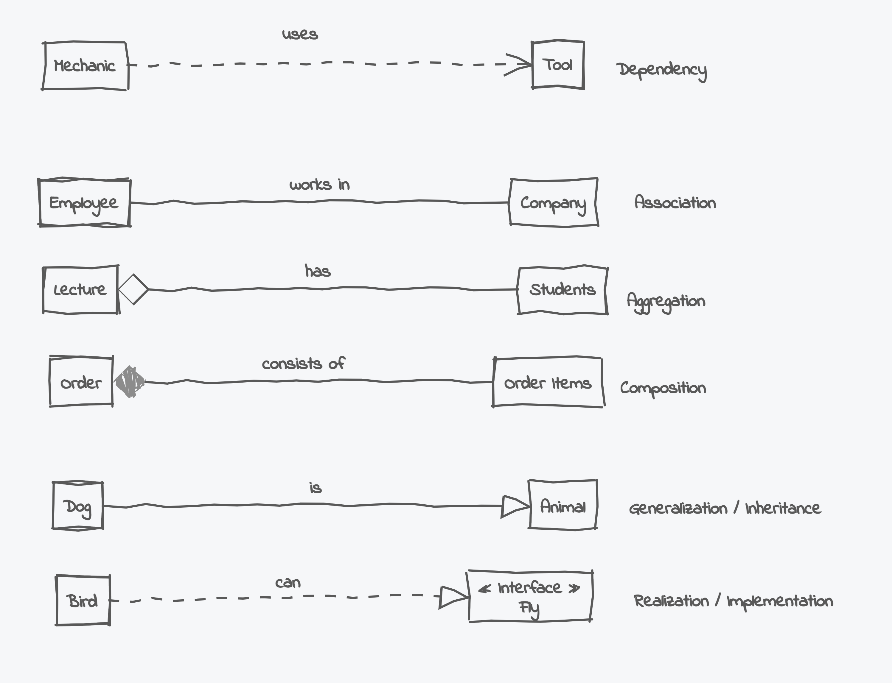

#### What is UML?

#### Basic perspective

- Creating nice large and complex diagrams
  - Various aspects of software systems

- But there is formal semantics too
  - Allows for validation, reasoning about models, and generating code.

- Relatively wide adoption
  - Who: business analyst, designers, architects

- Supported by many CASE tools and IDEs
  - CASE = computed-aided software engineering

Link [**UML Relation**](https://www.umlboard.com/docs/relations/)
